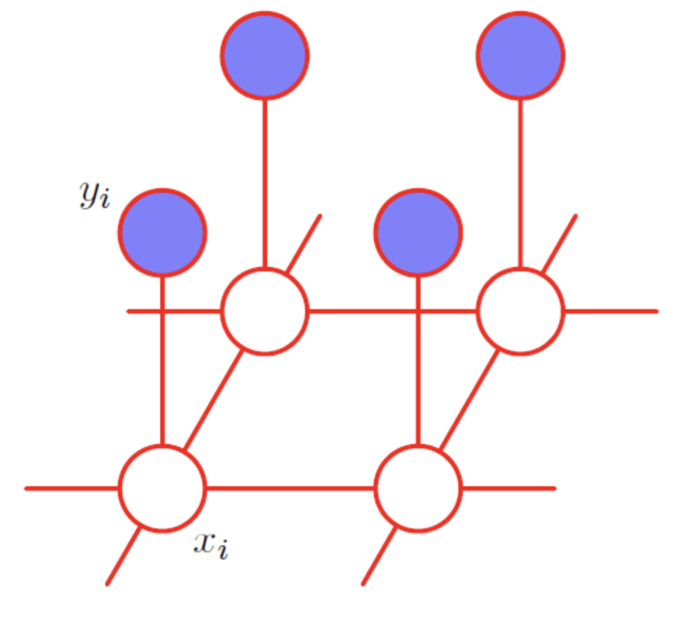

# RFIM-Inspired Image Denoising with MCMC

This project explores how **Markov Chain Monte Carlo (MCMC)** methods—specifically **Metropolis-Hastings** and **Gibbs sampling**—can be applied to **binary image denoising** by modeling pixels as spins in an **Ising-like Markov Random Field (MRF)**.

When the observed image acts as an **external field**, the system becomes analogous to the **Random Field Ising Model (RFIM)** from statistical physics.  
This analogy enables the study of **noise-induced phase transitions** between ordered (recoverable) and disordered (unrecoverable) states.

---

## 🔸 Overview

- **Models**
  - *Ising prior:* pairwise interaction enforcing local alignment.
  - *Anisotropic extension:* different couplings along horizontal, vertical, and diagonal directions.
  - *Posterior model:* adds a likelihood term acting as an external field from the observed noisy image.

- **Algorithms**
  - **Metropolis sampler:** stochastic spin-flip acceptance based on local energy differences.
  - **Gibbs sampler:** direct resampling from local conditional probabilities.
  - **Simulated annealing:** gradual temperature decay toward MAP estimation.

- **Applications**
  - Binary image denoising under MRF priors.
  - Visualization of RFIM-like phase transitions.
  - Empirical illustration of Bayesian inference as stochastic relaxation.

---

*Each node \(x_i\) represents a latent clean pixel, with \(y_i\) its noisy observation.
Edges encode spatial coupling (Ising prior), while vertical links represent the data likelihood — an external field aligning the model with the observed image.*

---

## 🔸 Phase Transition Interpretation

Increasing image noise induces a transition between distinct regimes:

- **Low noise:** spins align with the data field — the image structure is preserved.  
- **Intermediate noise:** partial disorder emerges — local clusters remain but global coherence weakens.  
- **High noise:** order collapses — the reconstruction loses structure.  

This phenomenon mirrors the **order–disorder transition** in the **Random Field Ising Model (RFIM)**.  
It highlights the connection between inference under noise and phase transitions in disordered systems.

**Reference:**  
M. Mézard and A. Montanari, *Information, Physics, and Computation*, Oxford University Press, 2009.

---

## 🔸 Repository Structure

